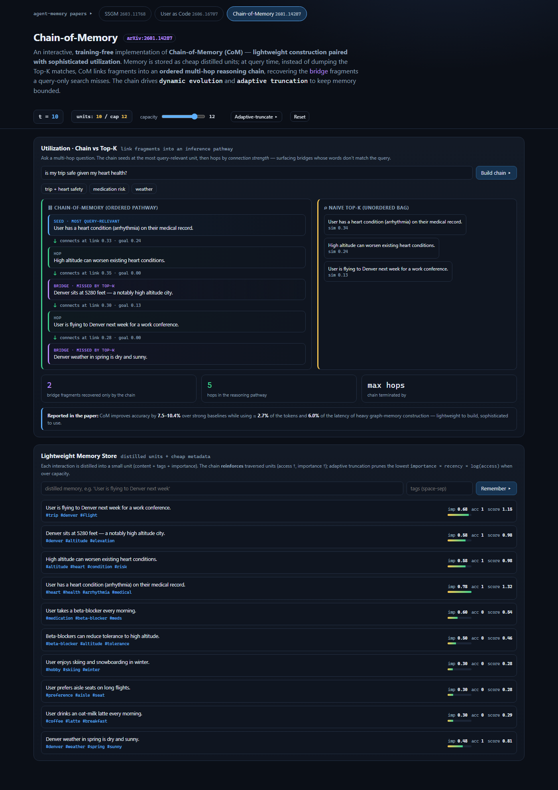
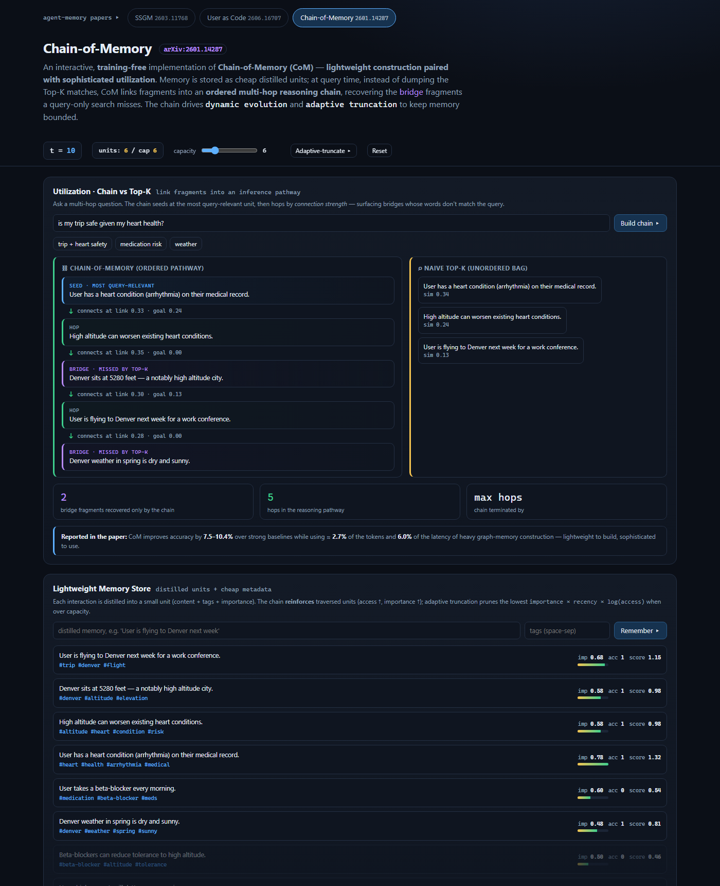

# Don't dump the top matches — walk a chain: implementing Chain-of-Memory

*A training-free, browser-native reference implementation of Chain-of-Memory (arXiv:2601.14287), and the third tab alongside [SSGM](ARTICLE.md) and [User as Code](USER_AS_CODE.md).*

---

## The problem: retrieval recalls, but reasoning needs a path

Most agent memory pipelines do two expensive things badly. First they **over-build**: heavy graph construction, entity/relation extraction on every turn — lots of compute for little gain. Then they **under-use** what they built: at query time they grab the Top-K most similar snippets, concatenate them, and hope the model connects the dots.

That second step is where multi-hop questions quietly fail. Consider:

> *"Is my trip safe given my heart condition?"*

The answer depends on a chain of facts:

```
user has a heart condition  →  high altitude worsens heart conditions  →  Denver is at 5,280 ft  →  user is flying to Denver
```

The killer detail: the middle link — *"Denver is a high-altitude city"* — shares **no words** with the question. It mentions neither "trip", "safe", "heart", nor "health". A query-only Top-K search never retrieves it, so the reasoning path is broken before the model even starts. This is the **retrieval–reasoning gap**.

Chain-of-Memory — *"Lightweight Memory Construction with Dynamic Evolution for LLM Agents"* (Xu et al.) — fixes it by inverting the effort: **lightweight construction, sophisticated utilization.** Store cheaply; then, instead of dumping Top-K, assemble the retrieved fragments into an **ordered, multi-hop reasoning chain**. The paper reports **7.5–10.4%** accuracy gains at roughly **2.7%** of the tokens and **6.0%** of the latency of heavy graph-memory systems.

---

## Utilization: chain vs. Top-K, side by side



The demo asks *"is my trip safe given my heart health?"* over a store of distilled memories and answers it two ways.

**Naive Top-K (right)** ranks units by similarity to the *query* and returns three: the heart condition, "altitude worsens heart", and "flying to Denver". It never surfaces *"Denver sits at 5,280 ft"* — that fact isn't similar to the question, so the altitude bridge is invisible.

**Chain-of-Memory (left)** builds an ordered pathway instead:

1. **Seed** at the unit most relevant to the query (the heart condition).
2. **Hop** to whichever remaining unit best *connects to the current frontier* while still pulling toward the query. Each hop shows its `link` (connection to the previous fragment) and `goal` (relevance to the query).

Because hops are chosen by **connection strength, not query similarity**, the chain walks *heart condition → altitude worsens heart → **Denver is high-altitude** → flying to Denver* — recovering the exact **bridge** fragments (marked in purple) that Top-K dropped. The scoreboard makes the win explicit: **2 bridge fragments recovered only by the chain.**

The hop score is a simple, training-free blend:

```
score(candidate) = 0.7 · sim(frontier, candidate)  +  0.3 · sim(query, candidate)
```

and the chain ends via **adaptive truncation** when no remaining candidate connects above a threshold — so it forms a coherent path rather than rambling.

---

## Construction & housekeeping: lightweight store, dynamic evolution, adaptive truncation



The other half is cheap and self-maintaining. Each interaction is distilled into a small **unit** — content, tags, an importance prior — with an embedding computed on demand (no graph building). Two mechanisms keep it healthy:

- **Dynamic evolution** — every unit the chain traverses is *reinforced*: its access count and importance tick up. Useful memories that keep showing up in reasoning paths get stronger (note the `acc 1` units in the store).
- **Adaptive truncation** — memory can't grow forever. Each unit carries a retention score

  ```
  score(u) = importance × recency-decay × (1 + log(1 + access))
  ```

  and when the store exceeds capacity, the lowest-scoring units are pruned. In the screenshot the capacity is dropped to 6: the reasoning-critical units (heart, altitude, Denver, the reinforced trip fact) are kept, while low-importance distractors (skiing, aisle-seat, latte) fade out. Task-critical information survives; trivia is bounded away.

---

## Mapping the paper to the code

| CoM concept | File |
|---|---|
| Lightweight distilled units + metadata; retention scoring; reinforce; truncate | [`store.js`](../src/com/store.js) |
| Chain construction (seed + connection-strength hops) & naive Top-K baseline | [`chain.js`](../src/com/chain.js) |
| Orchestration: query → chain + naive + bridges, dynamic evolution | [`core.js`](../src/com/core.js) |
| Training-free bag-of-terms similarity | [`embed.js`](../src/com/embed.js) |

```bash
node --test        # CoM tests (multi-hop bridge recovery, truncation, evolution) + the SSGM & UaC suites
npm run serve      # http://localhost:5178/chainofmemory.html
```

---

## Three views of the same shift

This repo now hosts three agent-memory papers as tabs, and together they cover the whole lifecycle:

- **[SSGM](ARTICLE.md)** — governs *how memory changes over time* (decay, gates, provenance, drift, rollback).
- **[User as Code](USER_AS_CODE.md)** — changes *what memory is* (a typed program you execute, not a bag of facts).
- **Chain-of-Memory** — changes *how you read memory back* (an ordered reasoning chain, not a Top-K dump).

Store it safely, structure it as code, and traverse it as a chain — three complementary answers to the same question of how an agent should remember.

## Disclaimer

This is **my own interpretation** of the Chain-of-Memory paper, built to understand it by implementing it. I've tried to stay faithful to its "lightweight construction + sophisticated utilization" thesis — the chain-based multi-hop utilization, dynamic evolution, and adaptive truncation — but I made concrete engineering choices where the paper is conceptual: a **bag-of-terms cosine** stands in for learned embeddings, and the hop score / thresholds are simple demonstrative values. **All credit for the ideas and innovation goes to the authors — Xiucheng Xu, Bingbing Xu, Xueyun Tian, Zihe Huang, Rongxin Chen, Yunfan Li, and Huawei Shen ([arXiv:2601.14287](https://arxiv.org/abs/2601.14287)).** Any errors of interpretation are mine.
