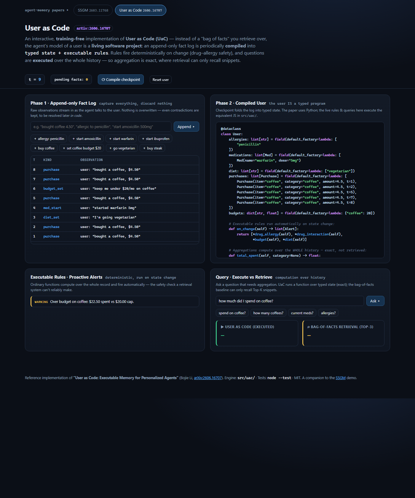
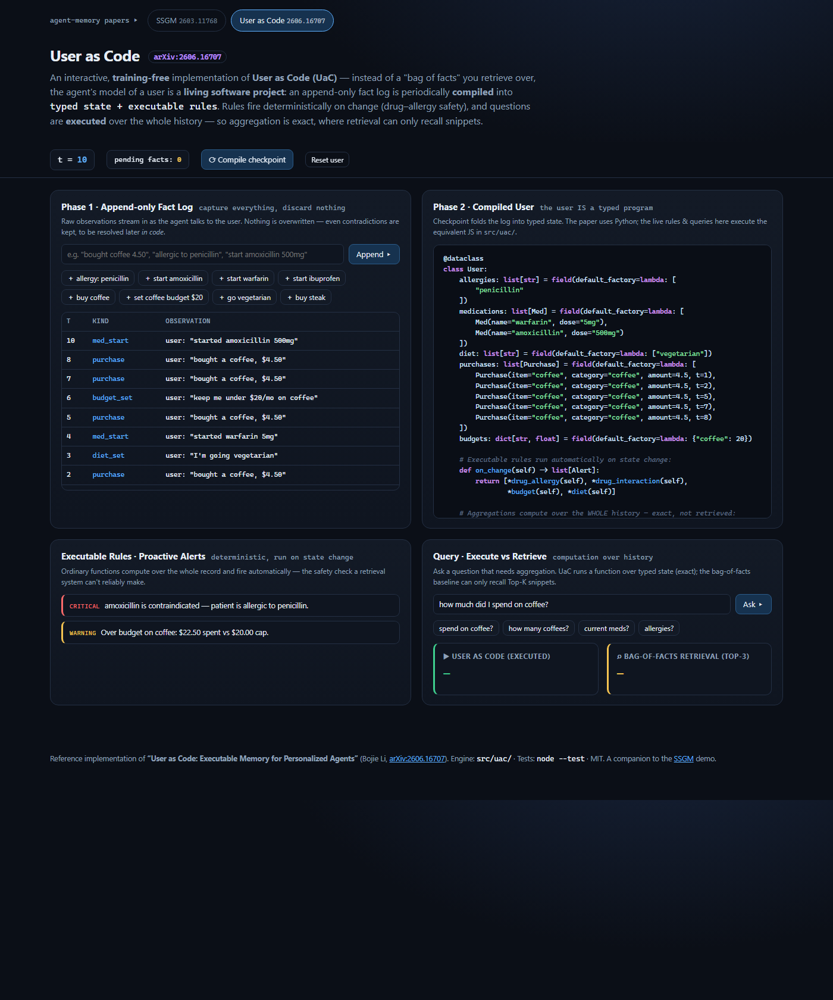
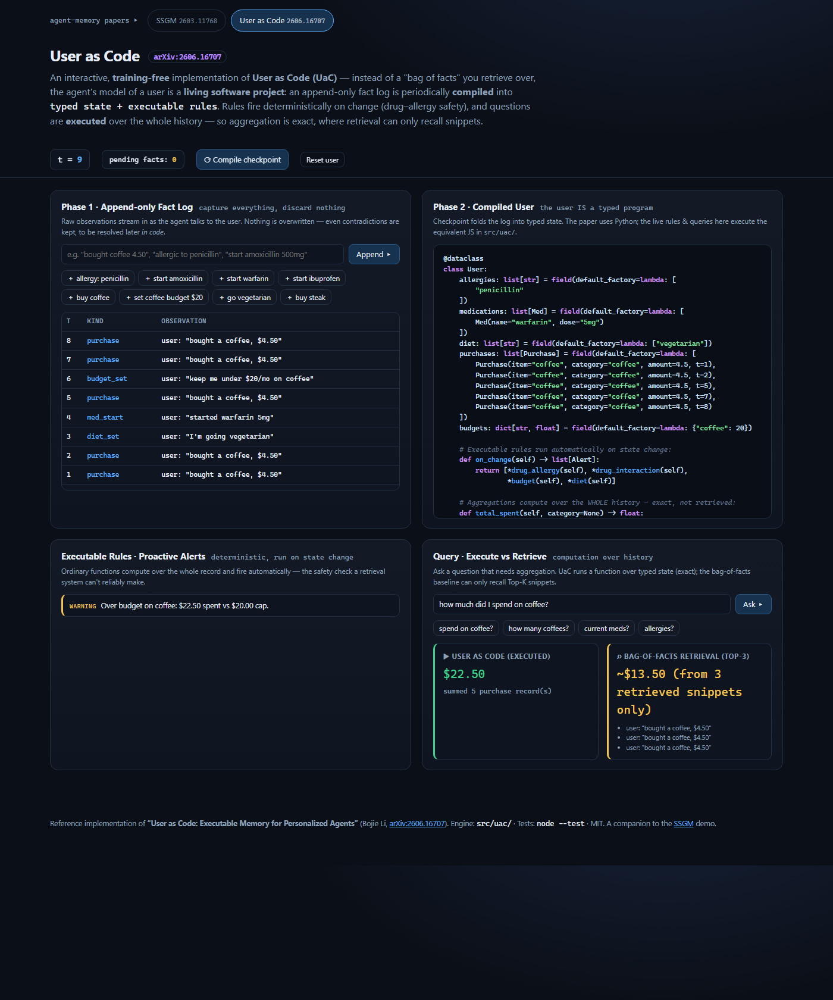

# The user isn't a pile of facts — the user is a program: implementing "User as Code"

*A training-free, browser-native reference implementation of User as Code (arXiv:2606.16707), and a companion to the [SSGM demo](ARTICLE.md).*

---

## The problem: "bag of facts" memory can't compute

Most agent memory today is a **bag of facts** — text snippets, a knowledge graph, a flat store you run retrieval over. That's fine for "what am I allergic to?" but it quietly fails the moment a question needs *computation over the whole history*:

- *"How much did I spend on coffee this month?"* — needs a **sum over every** purchase, not the three snippets retrieval happens to return.
- *"What am I actually taking right now?"* — needs the log **deduplicated** with the "stopped" events applied, not whatever fragments match.
- *"Is this new prescription safe?"* — needs a rule checked against the **entire** record at once.

Retrieval recalls; it does not calculate. The paper — **"User as Code: Executable Memory for Personalized Agents"** (Bojie Li) — reports the gap starkly: on questions requiring computation over many historical records, retrieval scores **6–43%** while the executable approach reaches **~99%**.

## The idea: compile the user into typed state + executable rules

UaC's move is to treat the agent's model of a user as a **living software project**: *typed objects hold the user's state, and ordinary functions encode the rules that govern it.* It runs a **two-phase pipeline**:

1. **Capture** — every observation is appended to an immutable log. Nothing is discarded, contradictions included.
2. **Compile** — the log is periodically checkpointed into a **typed `User` object**; functions then compute over it and rules fire deterministically.

This repository implements that, training-free, as a page you can play with. The three panels below map one-to-one to the paper.

---

## Phase 1 + 2: from a raw log to a compiled user



On the left, raw utterances stream into the **append-only fact log** (`"bought a coffee, $4.50"`, `"I'm going vegetarian"`, `"started warfarin"`). On the right, **Compile checkpoint** folds that log into typed state, rendered as source — the user *literally is* a small typed program:

```python
@dataclass
class User:
    allergies: list[str]      = [...]
    medications: list[Med]    = [...]
    diet: list[str]           = [...]
    purchases: list[Purchase] = [...]
    budgets: dict[str, float] = {...}

    def on_change(self) -> list[Alert]:      # rules run on every state change
        return [*drug_allergy(self), *drug_interaction(self), *budget(self), *diet(self)]

    def total_spent(self, category=None) -> float:   # aggregation over the WHOLE history
        return sum(p.amount for p in self.purchases if category is None or p.category == category)
```

*(The paper uses Python; the live rules and queries in this demo execute the equivalent JavaScript in [`src/uac/`](../src/uac/).)*

Compilation is also where **contradictions are resolved in code**, not left ambiguous: a later "stopped warfarin" removes it from `medications`; "I'm no longer vegetarian" clears the diet. A bag of facts would keep all of them and hope retrieval picks right.

---

## Executable rules: proactive, deterministic safety



Because the whole record is available as typed data, rules are just functions that run on every change. Append `amoxicillin` to a user whose `allergies` include penicillin and the rule fires immediately and deterministically:

> **CRITICAL** — amoxicillin is contraindicated: patient is allergic to penicillin.

alongside a drug-interaction check and a budget check that **aggregates every purchase**. This is the paper's headline safety benefit: a retrieval system can't reliably make this call, because the check depends on facts that may not co-occur in any single retrieved window.

---

## Query: execute vs. retrieve



The clearest demonstration of the whole thesis. Ask *"how much did I spend on coffee?"* over five coffee purchases:

| Strategy | Answer | Why |
|---|---|---|
| **User as Code** (executed) | **$22.50** ✓ | `sum()` over all five typed `Purchase` records |
| **Bag-of-facts retrieval** (Top-3) | ~$13.50 ✗ | only the three retrieved snippets are visible — it *cannot reach the true total* |

The retrieval baseline here is faithful, not a strawman: it's exactly what RAG does — fetch the Top-K matching snippets — and exactly why it truncates on computation-over-history. UaC executes a function over the complete typed state, so the answer is exact.

---

## Mapping the paper to the code

| UaC concept | File |
|---|---|
| Append-only capture + checkpoint compile (two-phase pipeline) | [`core.js`](../src/uac/core.js) |
| Executable rules (drug–allergy, interaction, budget, diet) | [`rules.js`](../src/uac/rules.js) |
| Aggregation query vs. bag-of-facts retrieval baseline | [`query.js`](../src/uac/query.js) |
| Rendering the compiled user as source | [`codegen.js`](../src/uac/codegen.js) |

```bash
node --test        # UaC governance/behaviour tests (plus the SSGM suite)
npm run serve      # http://localhost:5178/userascode.html
```

---

## Two views of the same shift

SSGM and UaC attack agent memory from opposite ends, and this repo hosts both as tabs:

- **[SSGM](ARTICLE.md)** governs *how memory changes over time* — decay, contradiction gates, provenance, drift bounding, rollback.
- **User as Code** changes *what memory is* — from a bag of facts you retrieve into a typed program you execute.

Put together, they sketch the same future: an agent's memory as governed, executable, auditable software rather than an ever-growing pile of text.

## Disclaimer

This is **my own interpretation** of the User-as-Code paper, built to understand it by implementing it. I've tried to stay faithful to its two-phase pipeline, typed-state model, and executable-rule paradigm, but I made concrete engineering choices where the paper is conceptual — notably rendering/executing the compiled user in **JavaScript** rather than Python, and using a lightweight keyword parser for free-text input. **All credit for the ideas and innovation goes to the author, Bojie Li ([arXiv:2606.16707](https://arxiv.org/abs/2606.16707)).** Any errors of interpretation are mine.
